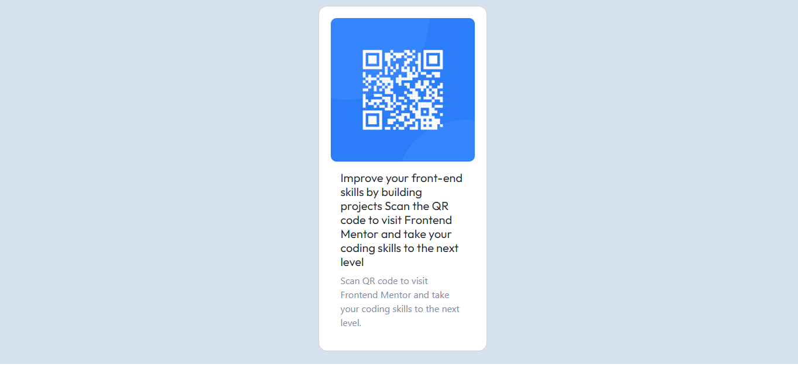

# Frontend Mentor - QR code component solution

## Table of contents

## Overview

### Screenshot

### Links

- Solution URL: [Add solution URL here](https://your-solution-url.com)
- Live Site URL: [live site URL]( https://licifer666.github.io/)

## My process

### Built with

1. HTML5
2. CSS3
3. Bootstrap 5

### What I learned

- I learned (Recall) my HTML, CSS, Bootstrap method of creating a responsive web page when the time of development i really realize that what you have learn and practice some time is not importent you continously practice.

### Continued development

-In future i modify and improve the UI and add animation and Improve UserInterface(UI).

### Useful resources

- [Example resource 1](https://www.w3schools.com/) - This helped me for HTML and CSS . I really liked this pattern and will use it going forward.
- [Example resource 2](https://developer.mozilla.org/en-US/ ) - This is an another documentation Website for learn HTMl, CSS, JS etc. 

- [Example resource 3](https://getbootstrap.com/docs/5.0/getting-started/introduction/) - This is official Bootsstrap documentation page where i learn and use Bootstrap methods or pre defined styles.

**Note: Delete this note and replace the list above with resources that helped you during the challenge. These could come in handy for anyone viewing your solution or for yourself when you look back on this project in the future.**

## Author

- Frontend Mentor - [@Licifer666](https://www.frontendmentor.io/profile/Licifer666)

## overview

- In this QR-code challenge I developed using some of my own technique i learned Before

- I used Basic HTML, CSS and Bootstrap Card method for card layout and design I do not use CSS Media Query for Responsiveness
